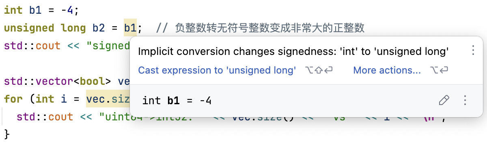

# 快速检查常见错误的工具

## Clang-Tidy
> clang-tidy is a clang-based C++ “linter” tool. Its purpose is to provide an extensible framework for diagnosing and fixing typical programming errors, like **style violations, interface misuse, or bugs that can be deduced via static analysis**.

[clang.llvm.org/extra/clang-tidy/](https://clang.llvm.org/extra/clang-tidy/)  
[clang-tidy静态语义检查，安装、使用、检查项注解](https://blog.csdn.net/Fenplan/article/details/119755111)

用法示例：
```bash
clang-tidy -checks="clang-analyzer-*,bugprone-*,abseil-*,google-*,performance-*" *.cpp
```

vscode 中安装 C/C++ 插件后自带 ClangTidy 检查功能。设置中搜索 ClangTidy 可添加具体的检查项：  

`F1/Ctrl+Shift+P`运行`Run Code Analysis on ...`即可执行 ClangTidy 代码检查：  


## CLion
CLion 自带实时代码分析并高亮显示，其检查项比 ClangTidy 更全面

